# Pruebas de validación

En este documento se muestran algunas de las pruebas de validación realizadas sobre el sistema de conducción autónoma desarrollado. 

El objetivo de estas pruebas es por un lado comprobar que se han cumplido los objetivos del proyecto, y por otro lado, determinar el alcance del sistema desarrollado. 

# - Pruebas sobre el sistema encargado de seguir el circuito - 

## Resultado normal extracción líneas

Primero se muestra un resultado de una reconstrucción de las líneas de la carretera correcta bajo condiciones normales:

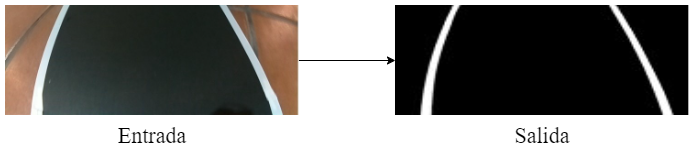

&nbsp;

## Resultados bajo diferentes iluminaciones
En este caso el objetivo es probar si el sistema encargado de extraer las caracteristicas de las lineas es capaz de funcionar correctamente bajo situaciones especiales de iluminación.

&nbsp;

- **Reflejos en el recorrido:**

A continuación, se muestran algunos ejemplos de reconstrucciones bajo la presencia de reflejos.

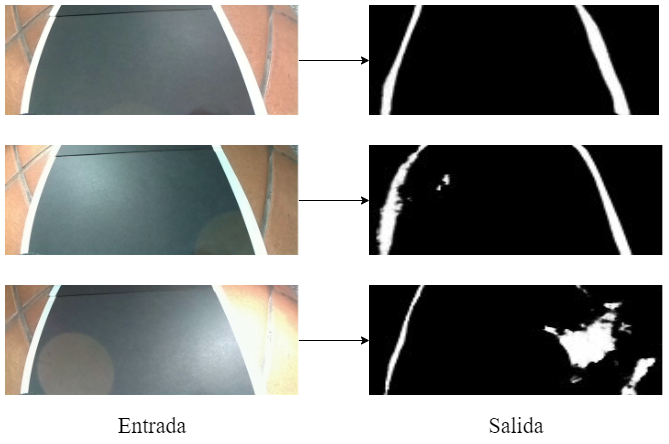

&nbsp;

- **Sombras en el recorrido:**

A continuación, se muestran algunos ejemplos de reconstrucciones bajo la presencia de sombras.

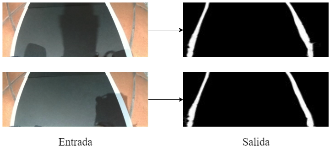

&nbsp;

- **Iluminación reducida:**

A continuación, se muestran algunos *frames* de las reconstrucciones realizadas en casos de baja iluminación.

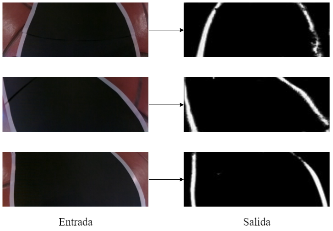

&nbsp;

También se aporta un **vídeo** de estos resultados: 

Enlace: https://youtu.be/eoNWFBYqqeo

&nbsp;

## Resultados ante modificaciones en el escenario

- **Objetos en medio del circuito:**

Algunas reconstrucciones con objetos en medio del circuito:

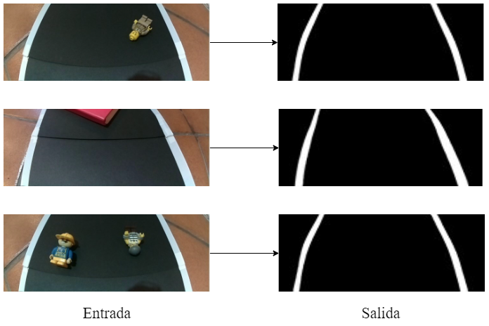

&nbsp;

- **Objetos fuera del circuito:**

A continuación, se muestran algunos ejemplos de reconstrucciones con objetos en la parte exterior del circuito.

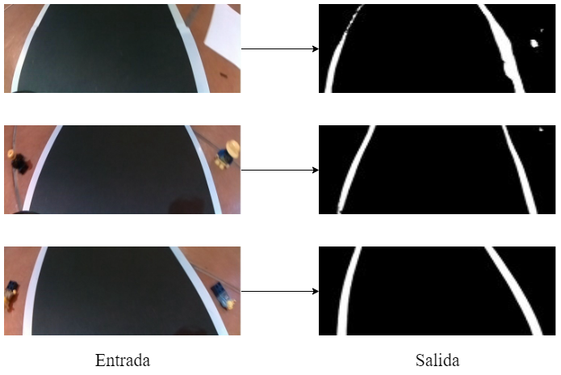

&nbsp;

## Resultados ante lineas parcialmente ocultas

A continuación, se muestran algunos *frames* de las reconstrucciones realizadas con las líneas del circuito parcialmente ocultas.

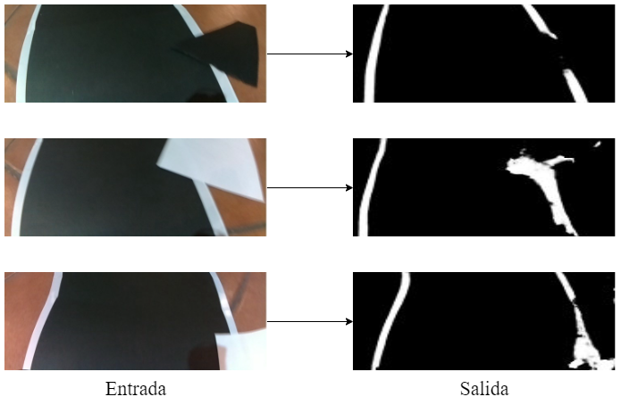

&nbsp;

Estos resultados también se aportan en **vídeo**: 

Enlace: https://youtu.be/YT2HjIt6cu4

&nbsp;

Por otro lado, también se aporta un **vídeo** mostrando el funcionamiento real del vehículo en estos casos: 

Enlace: https://youtu.be/PdNhqsk8-N0

&nbsp;

## Resultados en escenario diferente

A continuación, se muestran algunos *frames* de la reconstrucción realizada por el sistema al cambiar el escenario:

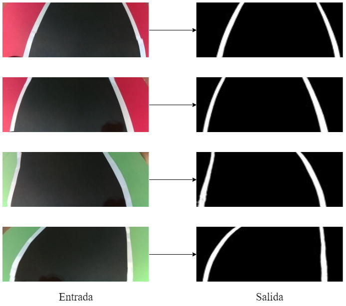

&nbsp;

&nbsp;

# - Pruebas sobre el sistema encargado de detectar las señales - 

## Resultado normal detección de señales 

A continuación, se muestra un resultado correcto de la detección de señales:

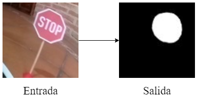

&nbsp;

## Resultados con señales en distintas posiciones y ángulos

A continuación, se muestran los resultados obtenidos al colocar las señales en diferentes posiciones de las que se ha entrenado, así como en diferentes ángulos:

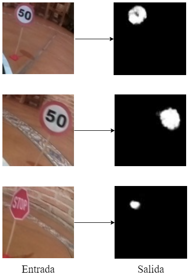

&nbsp; 

## Resultados bajo iluminación reducida

A continuación, se muestran los resultados obtenidos bajo situaciones de iluminación reducida: 

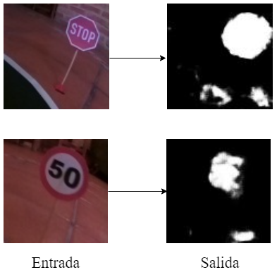

&nbsp;

## Resultados con distintos tamaños y distancias

A continuación, se muestran los resultados obtenidos al situar las señales más cerca/lejos del circuito:

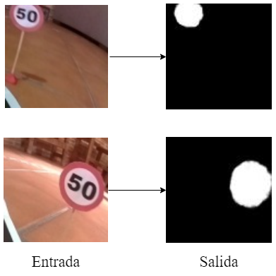

&nbsp;

## Resultados en distintos escenarios

A continuación, se muestran los resultados obtenidos al modificar el escenario (fondo):

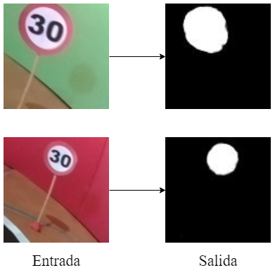

&nbsp;

