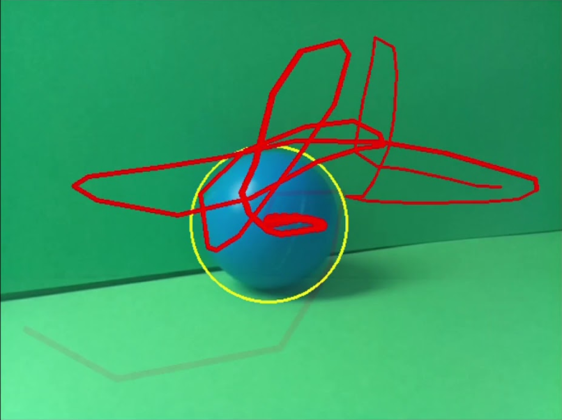
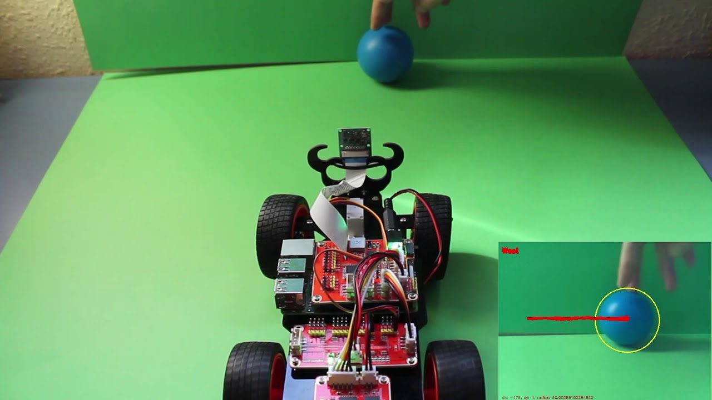

# Vídeos Fase 0: Trabajo Previo

## Seguimiento de una pelota

- [**Video 0.1: Seguimiento de pelota en pantalla**](https://youtu.be/Wp0OlhT35a4)

Enlace: https://youtu.be/Wp0OlhT35a4

&nbsp;

- [**Video 0.2: Seguimiento de pelota con vehículo estático**](https://youtu.be/gCUweJSI_6k)

Enlace: https://youtu.be/gCUweJSI_6k