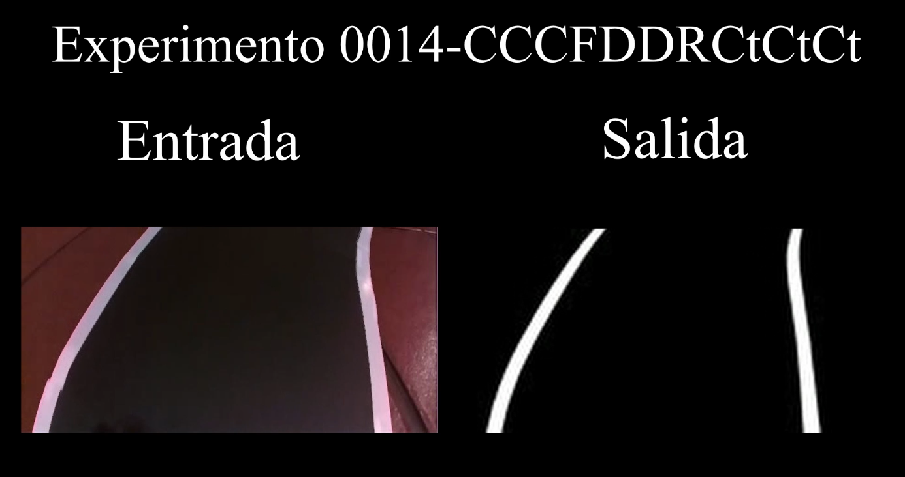

# Vídeos Fase 3: Extracción de características de las líneas

- [**Video 3.1: Resultados del experimento 0001-lines**](https://youtu.be/uP7nQfg3Hh4)

Enlace: https://youtu.be/uP7nQfg3Hh4

&nbsp;

- [**Video 3.2: Resultados del experimento 0003-lines**](https://youtu.be/ofWbmHXaw3I)

Enlace: https://youtu.be/ofWbmHXaw3I

&nbsp;

- [**Video 3.3: Resultados del experimento 0008-lines**](https://youtu.be/i7J_p0HrJ5Y)

Enlace: https://youtu.be/i7J_p0HrJ5Y

&nbsp;

- [**Video 3.4: Resultados del experimento 0010-lines**](https://youtu.be/h8ZsmO7i0II)

Enlace: https://youtu.be/h8ZsmO7i0II

&nbsp;

- [**Video 3.5: Resultados del experimento 0014-lines**](https://youtu.be/ZbW1cmL9ZO0)

Enlace: https://youtu.be/ZbW1cmL9ZO0

&nbsp;

