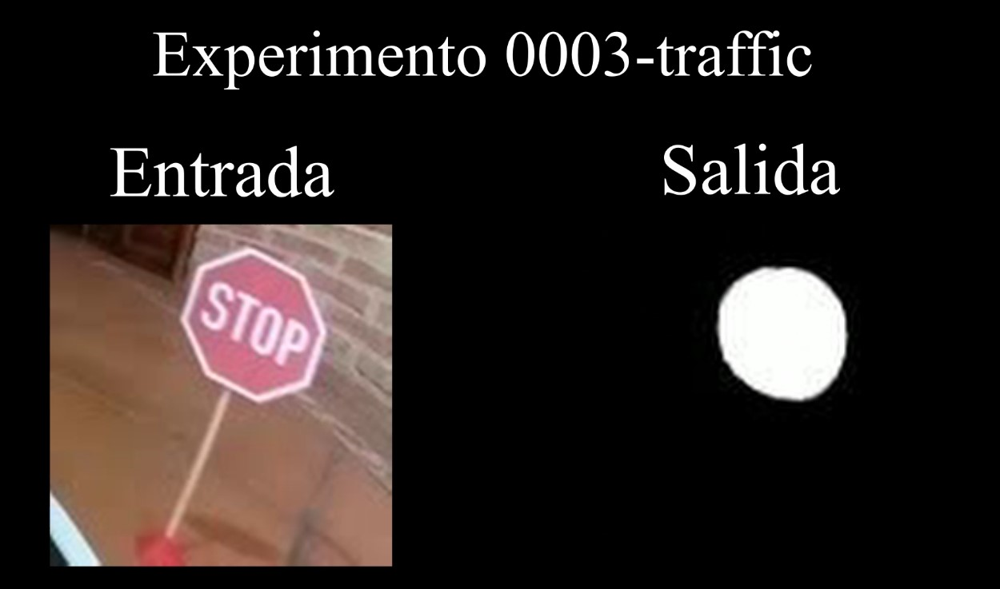

# Vídeos Fase Final: Diseño y experimentación finales

- [**Vídeo 5.1: Resultados del experimento 0016-lines**](https://youtu.be/IavnvXIG3SU)

Enlace: https://youtu.be/IavnvXIG3SU

&nbsp;

- [**Vídeo 5.2: Comparación entre diferentes valores de ruido**](https://youtu.be/dD_G6pw7Sd0)

Enlace: https://youtu.be/dD_G6pw7Sd0

&nbsp;

- [**Vídeo 5.3: Prueba de conducción en sentido antihorario con experimento 0013-drive**](https://youtu.be/W3REOluFArY)

Enlace: https://youtu.be/W3REOluFArY

&nbsp;

- [**Vídeo 5.4: Pruebas en ambos sentidos del experimento 0017-drive**](https://youtu.be/XA6ZSdO4INc)

Enlace: https://youtu.be/XA6ZSdO4INc

&nbsp;

- [**Vídeo 5.5: Pruebas de velocidad con el modelo final**](https://youtu.be/UV0zoLbDFfY)

Enlace: https://youtu.be/UV0zoLbDFfY

&nbsp;

- [**Vídeo 5.6: Resultados del experimento 0003-traffic**](https://youtu.be/4W4Gi_DRKek)

Enlace: https://youtu.be/4W4Gi_DRKek

&nbsp;

- [**Vídeo 5.7: Resultado final del sistema desarrollado**](https://youtu.be/uRtuk50vNdM)

Enlace: https://youtu.be/uRtuk50vNdM
